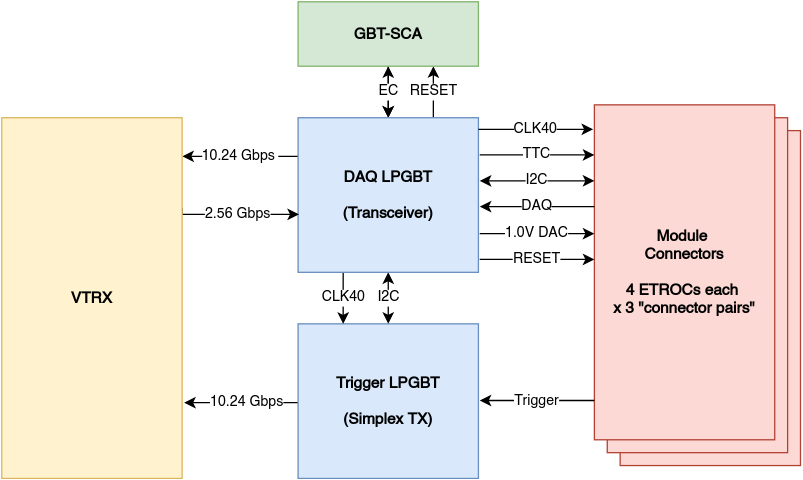
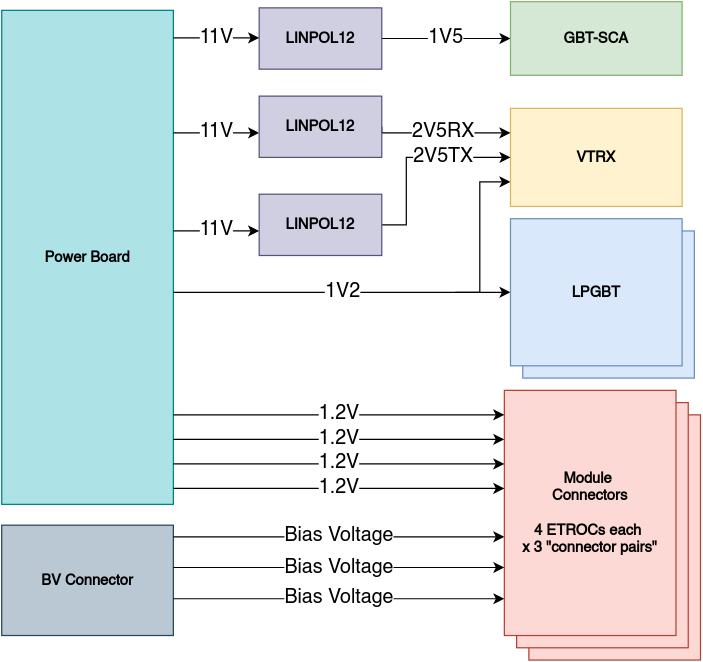
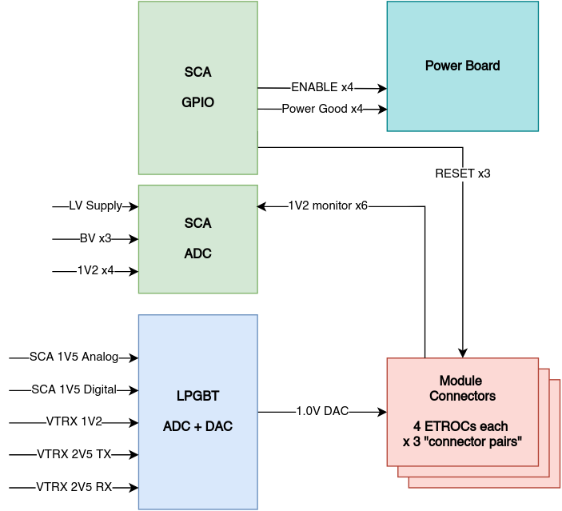
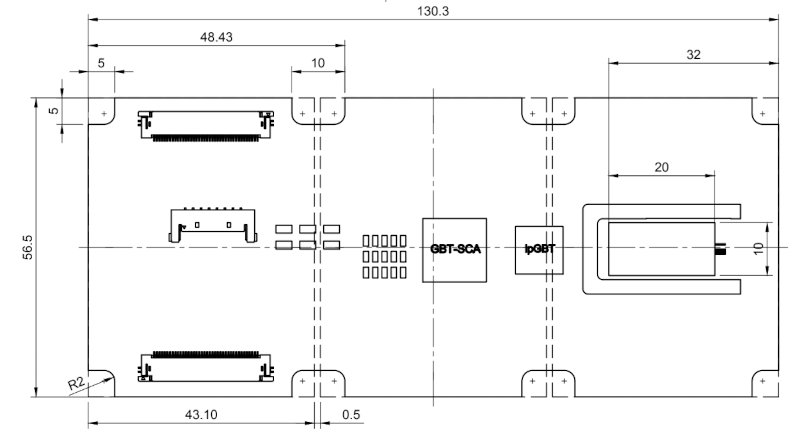

# Table of Contents TOC\_4

  - [Useful Links](#useful-links)
      - [Relevant Presentations](#relevant-presentations)
  - [Block Diagrams](#block-diagrams)
      - [Data Flow](#data-flow)
      - [Power Distribution](#power-distribution)
      - [Control and Monitoring](#control-and-monitoring)
  - [Connectors/Interfaces](#connectorsinterfaces)
  - [Mechanical Outline](#mechanical-outline)
  - [Jumpers](#jumpers)
  - [Pin Assignments](#pin-assignments)
      - [E-Link Assignments](#e-link-assignments)
      - [LPGBT Pin Assignments](#lpgbt-pin-assignments)
      - [SCA Pin Assignments](#sca-pin-assignments)

## Useful Links

  - TDR -
    [LHCC-P-009](https://cds.cern.ch/record/2296612/files/LHCC-P-009.pdf)

### Relevant Presentations

  - 2019/05/13 - [Update on Power board and Patch
    Panel-0](https://indico.cern.ch/event/820512/contributions/3429658/attachments/1842929/3023621/ETL-Cabling-S_Los-May13-2019.pdf)
    (Sergey V.)
  - 2020/03/09 - [ETL LV powering
    scheme](https://indico.cern.ch/event/902328/contributions/3798257/attachments/2008611/3355343/2020-03-09_LV_scheme.pdf)
    (Natalia K.)
  - 2020/04/05 - [ETL Readout Board
    v2](https://indico.cern.ch/event/906805/contributions/3815774/attachments/2016073/3369701/2020-04-05-ETL-RBv2-Boston.pdf)
    (Andy P.)
  - 2020/04/27 - [EIE
    Dataformat](https://indico.cern.ch/event/912420/contributions/3837314/attachments/2026902/3391190/Andy_Liu_-_Emulator_v1.1.pdf)
    (Andy L.)
  - 2020/06/02 - [ETROC Power
    consumption](https://indico.cern.ch/event/931796/contributions/3915833/attachments/2061731/3458677/ETROC2-power-update-v1.pdf)
    (Andy P.)
  - 2020/07/13 - [Readout Board
    Interfaces](https://indico.cern.ch/event/939160/contributions/3946133/attachments/2073487/3481402/20200713_readout_board_interfaces.pdf)
    (Andy P.)
  - 2020/08/31 - [Readout Board v2
    Update](https://indico.cern.ch/event/950697/contributions/3993986/attachments/2093983/3519322/20200831_readout_board_v2.pptx.pdf)
    (Andy P.)
  - 2020/08/31 - [Power Board
    Status](https://indico.cern.ch/event/950697/contributions/3993988/attachments/2094005/3519146/ETL-PowerConversion-S_Los-Aug31-2020.pdf)
    (Sergey V.)

## Block Diagrams

### Data Flow

### Power Distribution

### Control and Monitoring

## Connectors/Interfaces

## Mechanical Outline

## Jumpers

## Pin Assignments

### E-Link Assignments

### LPGBT Pin Assignments

### SCA Pin Assignments
